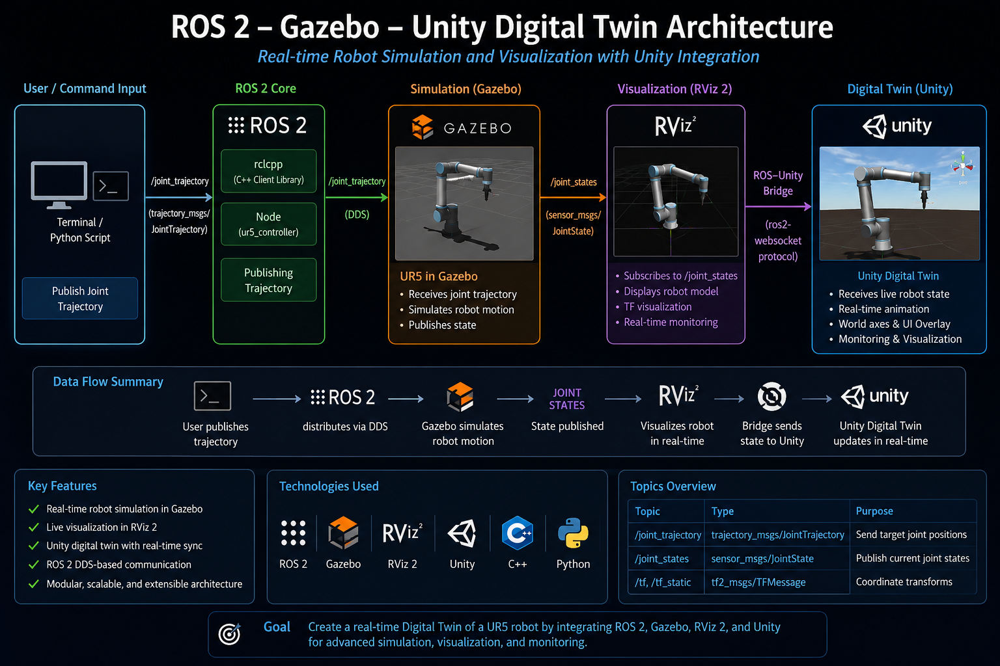
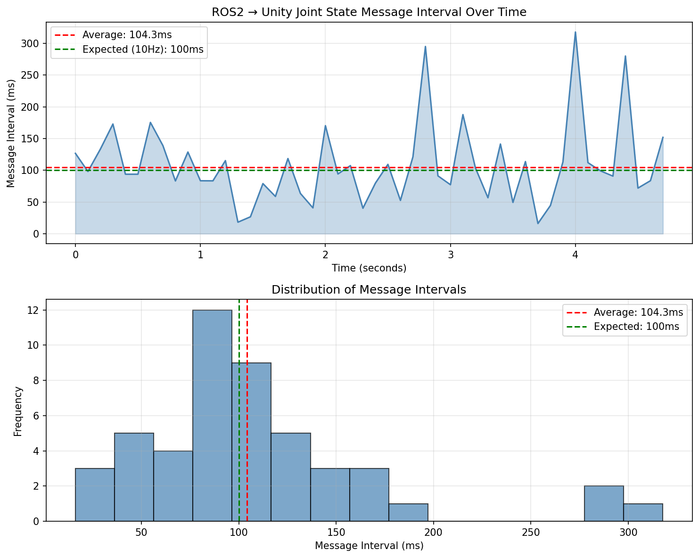

# Digital Twin & CPS Development for UR5e Robotic Arm

## ROS2 · Gazebo · Unity 3D · ML Anomaly Detection

**Author:** Md. Rafiqul Islam | BUTEX
**Period:** June 2026 –

## Overview
A complete real-time digital twin framework integrating ROS2 Humble with Unity 3D, enabling live synchronization of a UR5e 6-axis robotic arm between Gazebo simulation and Unity virtual environment — extended to a multi-machine virtual lab with bidirectional control and ML-powered anomaly detection.

## Objectives
- Build a real-time digital twin of a 6-axis industrial robotic arm
- Establish ROS2–Unity bidirectional communication via TCP bridge
- Synchronize joint states between Gazebo and Unity at 10Hz
- Implement bidirectional control from Unity UI to Gazebo
- Build multi-machine virtual lab with conveyor belt
- Add ML-based anomaly detection on joint state data

## Results

### Stage 1 — Core Digital Twin
- ✅ UR5e arm fully simulated in Gazebo with joint trajectory controller
- ✅ Custom ROS2 joint state publisher (6 DOF, 10Hz)
- ✅ ROS2–Unity TCP bridge via ROS-TCP-Connector
- ✅ Unity scene mirrors Gazebo in real time
- ✅ Live joint angle UI overlay in Unity Game view
- ✅ Latency measurement: avg 104.3ms (VirtualBox environment)
- ✅ rosbag2 motion recording and verified replay

### Stage 2 — Bidirectional Control & Multi-Machine Lab
- ✅ Bidirectional control — 6-joint Unity UI sliders → ROS2 → Gazebo
- ✅ Conveyor belt added to Gazebo and Unity scene
- ✅ Multi-machine virtual lab synchronized simultaneously
- ✅ Live status panel for robot and conveyor in Unity

### Stage 3 — AI Control Layer
- ✅ ML-based anomaly detection (IsolationForest) on joint state data
- ✅ Real-time anomaly alerts in Unity UI (red/green)
- ✅ 500-sample normal motion dataset collected via rosbag2
- 🔄 Reinforcement learning-based control (Unity ML-Agents) — under development

## System Architecture

## Latency Analysis

| Metric | Value |
|---|---|
| Average interval | 104.3ms (~10Hz) |
| Min interval | 0.0ms |
| Max interval | 317.8ms |
| Environment | VirtualBox (Ubuntu 22.04 → Windows 11) |

## Anomaly Detection

## Tech Stack
ROS2 Humble · Ubuntu 22.04 · Unity 2022 LTS · Python · C# · URDF · Gazebo · RViz · ROS-TCP-Connector · scikit-learn · Unity ML-Agents

## Demo
🎬 Playlist: [YouTube Playlist Link]  
🌐 Portfolio: https://sites.google.com/view/md-rafiqul-islam-butex/featured-project

## Repository Structure
- `src/joint_publisher/` — Joint publisher, slider controller, conveyor controller, anomaly detector
- `src/talker_listener/` — ROS2 pub/sub demo
- `src/ROS-TCP-Endpoint/` — ROS2–Unity bridge
- `ur5e_gazebo.launch.py` — Gazebo launch file
- `conveyor.urdf` — Conveyor belt model
- `ml_agents_config/` — ML-Agents training config
- `latency_plot.py` — Latency measurement script
- `anomaly_detection.py` — Anomaly detection script
- `collect_joint_data.py` — Joint data collection script
- `architecture_diagram.py` — Architecture diagram script
- `joint_data_normal.csv` — Normal motion dataset
- `latency_plot.png` — Latency analysis plot
- `anomaly_detection.png` — Anomaly detection plot
- `architecture_diagram.png` — System architecture diagram
