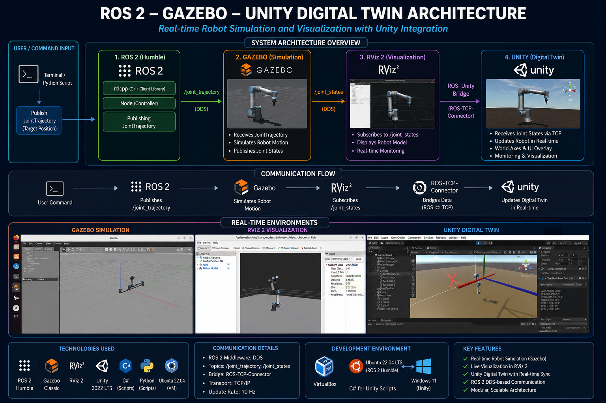
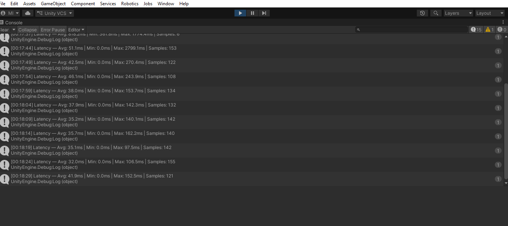
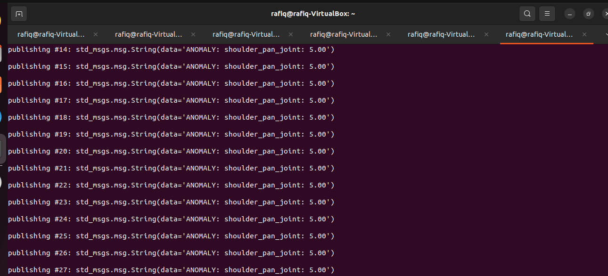
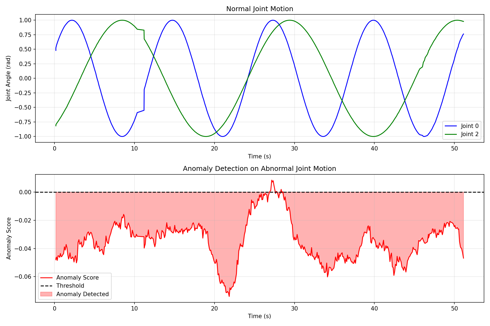

# Digital Twin & CPS Development for UR5e Robotic Arm
## ROS2 · MoveIt2 · Gazebo · Unity 3D · ML Anomaly Detection

**Author:** Md. Rafiqul Islam | BUTEX  
**Period:** May 2026 – Present

---

## Overview
A complete real-time digital twin framework integrating ROS2 Humble with Unity 3D, enabling live synchronization of a UR5e 6-axis robotic arm between Gazebo simulation and Unity virtual environment — extended to a multi-machine virtual lab with bidirectional control, MoveIt2 motion planning, and ML-powered anomaly detection.

---

## Objectives
- Build a real-time digital twin of a 6-axis industrial robotic arm
- Establish ROS2–Unity bidirectional communication via TCP bridge
- Synchronize joint states between Gazebo and Unity at 10Hz
- Implement bidirectional control from Unity UI to Gazebo
- Integrate MoveIt2 for intelligent motion planning
- Build multi-machine virtual lab with conveyor belt
- Add ML-based anomaly detection on joint state data

---

## Results

### Stage 1 — Core Digital Twin
- ✅ UR5e arm fully simulated in Gazebo with joint trajectory controller
- ✅ Custom ROS2 joint state publisher (6 DOF, 10Hz)
- ✅ ROS2–Unity TCP bridge via ROS-TCP-Connector
- ✅ Unity scene mirrors Gazebo in real time
- ✅ Live joint angle UI overlay in Unity Game view
- ✅ Latency measurement: avg 104.3ms (VirtualBox environment)
- ✅ rosbag2 motion recording and verified replay

### Stage 2 — Bidirectional Control & Multi-Machine Lab
- ✅ Bidirectional control — 6-joint Unity UI sliders → ROS2 → Gazebo
- ✅ Conveyor belt added to Gazebo and Unity scene
- ✅ Multi-machine virtual lab synchronized simultaneously
- ✅ Live status panel for robot and conveyor in Unity

### Stage 3 — AI Control Layer
- ✅ ML-based anomaly detection (IsolationForest) on joint state data
- ✅ Real-time anomaly alerts in Unity UI (red/green)
- ✅ 500-sample normal motion dataset collected via rosbag2
- 🔄 Reinforcement learning-based control (Unity ML-Agents) — under development

### Stage 4 — MoveIt2 Motion Planning
- ✅ MoveIt2 integrated with Gazebo simulation
- ✅ Collision-aware trajectory planning for UR5e
- ✅ Unity → ROS2 → MoveIt2 → Gazebo full pipeline
- ✅ Draggable target sphere in Unity sends goal pose to MoveIt2
- ✅ Goal accepted and executed in Gazebo and RViz
- 🔄 Advanced motion planning features under development

## System Architecture - Base

| Architecture Diagram - Base | Architecture Diagram - Extended |
|---|---|
|  |  |

## Latency Analysis
| Latency Measurement | Latency Measurement - Plot |
|---|---|
|  |  |

| Metric | Value |
|---|---|
| Average interval | 104.3ms (~10Hz) |
| Min interval | 0.0ms |
| Max interval | 317.8ms |
| Environment | VirtualBox (Ubuntu 22.04 → Windows 11) |

## Anomaly Detection

| Anomaly Detection | Anomaly Detection - Graph |
|---|---|
|  |  |

## Limitations & Known Constraints

### Hardware & Environment
- Full stack (Gazebo + MoveIt2 + RViz + Unity + ROS2 bridge) runs on a VirtualBox VM with 6GB RAM — causes occasional performance degradation and Gazebo instability under heavy load
- Static IP configuration required for stable ROS2–Unity bridge connection across VM network restarts
- Latency measurement (avg 104.3ms) reflects VirtualBox overhead — expected to be significantly lower on native hardware

### Software & Compatibility
- Unity ML-Agents Python package incompatible with Python 3.10 (Ubuntu 22.04 default) — blocks full RL training pipeline; currently under investigation
- ROS-TCP-Endpoint bridge occasionally crashes when Unity registers too many publishers simultaneously — requires manual restart
- MoveIt2 coordinate frame requires explicit transformation from Unity coordinate space (Y-up) to ROS2 frame (Z-up) before goal pose submission

### Motion Planning
- MoveIt2 planning occasionally fails for random target positions outside the UR5e reachable workspace — target sphere position must be manually constrained to valid workspace bounds
- `scaled_joint_trajectory_controller` (default MoveIt2 controller) not available in Gazebo simulation — requires `joint_trajectory_controller` configuration override

### Scope
- Conveyor belt visual motion in Gazebo not yet implemented — speed control is functional via ROS2 topic but belt mesh animation is pending
- RL-based control policy training not yet complete — Unity ML-Agents setup is ready but training loop blocked by Python version conflict
- Digital twin currently mirrors simulation only — physical robot hardware integration not yet implemented

## Tech Stack
ROS2 Humble · MoveIt2 · Ubuntu 22.04 · Unity 2022 LTS · Python · C# · URDF · Gazebo · RViz · ROS-TCP-Connector · scikit-learn · Unity ML-Agents

## Demo
🎬 Playlist: https://www.youtube.com/watch?v=lRkw54mJkNw&list=PLEOv3BqRrw_w&index=4

🌐 Portfolio: https://sites.google.com/view/md-rafiqul-islam-butex/digital-twin-project?authuser=0

## Repository Structure
- `src/joint_publisher/` — Joint publisher, slider controller, conveyor controller, anomaly detector, MoveIt commander
- `src/talker_listener/` — ROS2 pub/sub demo
- `src/ROS-TCP-Endpoint/` — ROS2–Unity bridge
- `launch/` — Gazebo and MoveIt launch files
- `models/urdf/conveyor.urdf` — Conveyor belt model
- `ml_agents_config/` — ML-Agents training config
- `scripts/` — Latency, anomaly detection, data collection scripts
- `data/csv/joint_data_normal.csv` — Normal motion dataset
- `unity/` — Unity C# scripts
